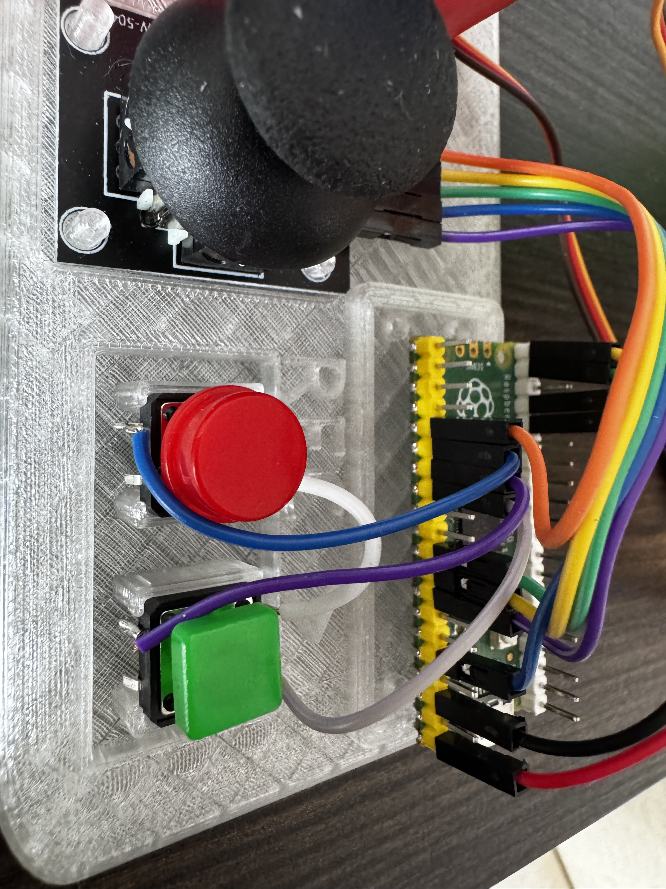
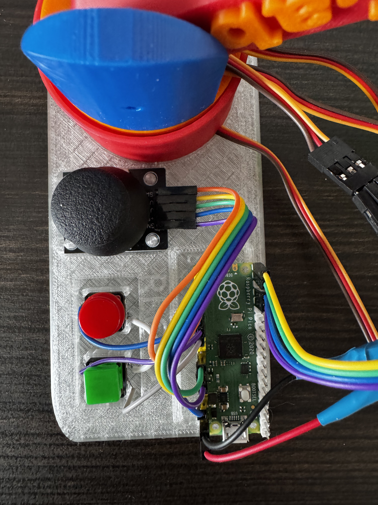
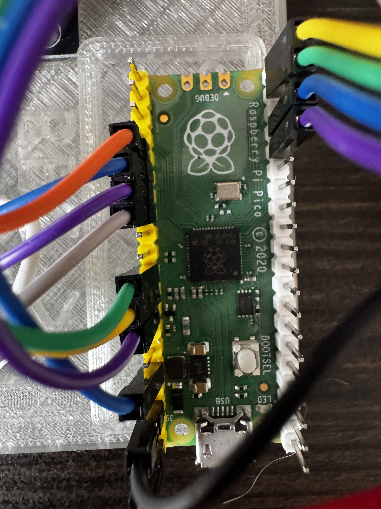
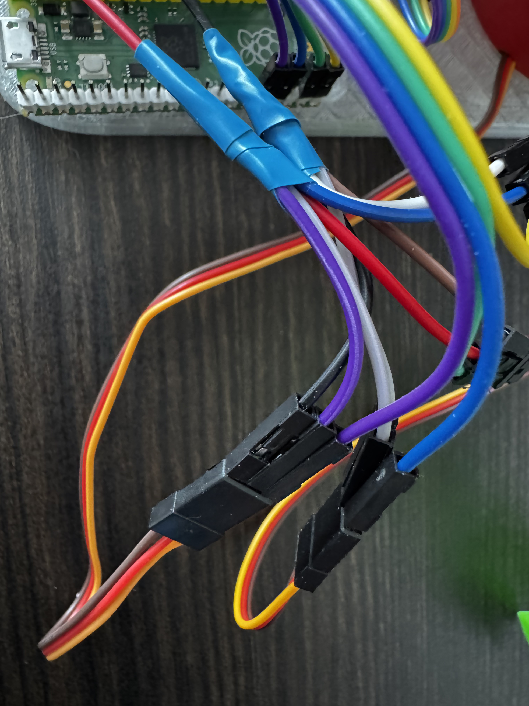
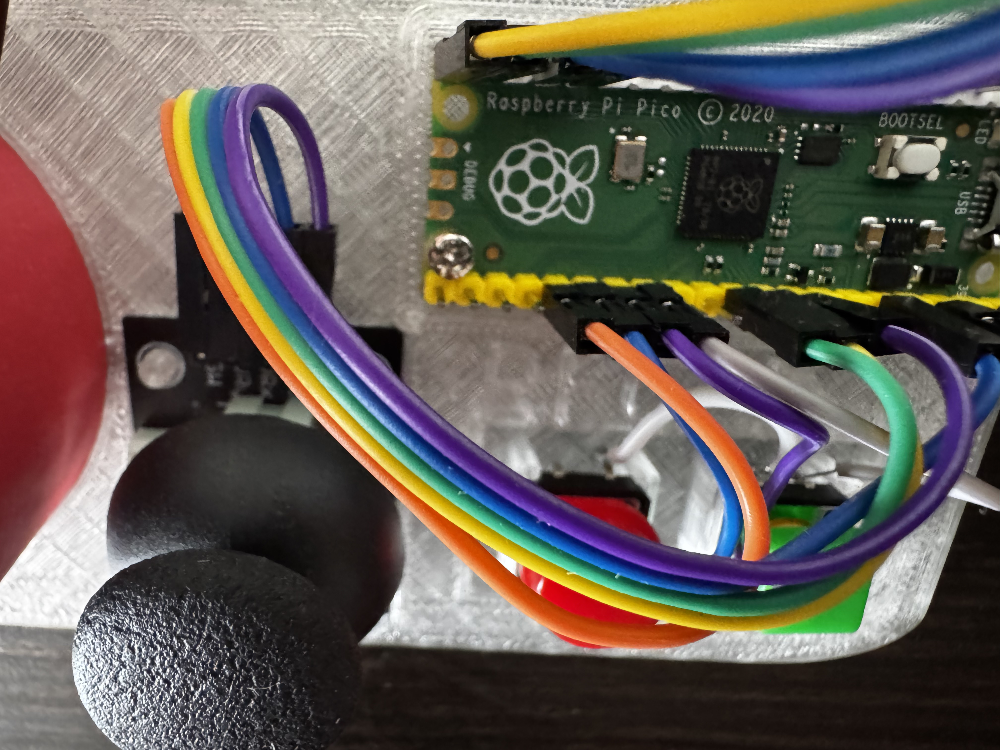
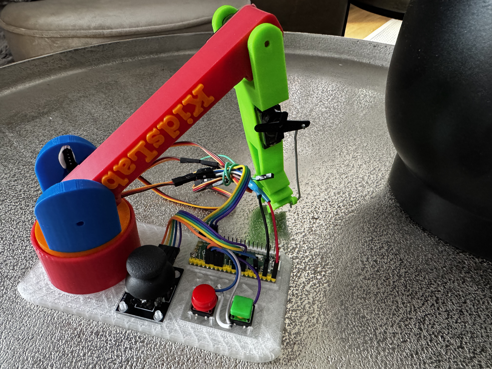
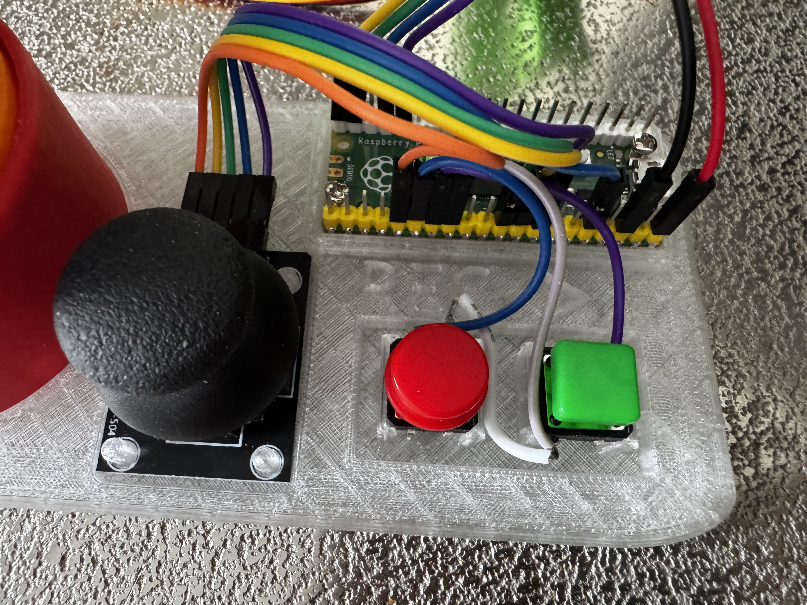
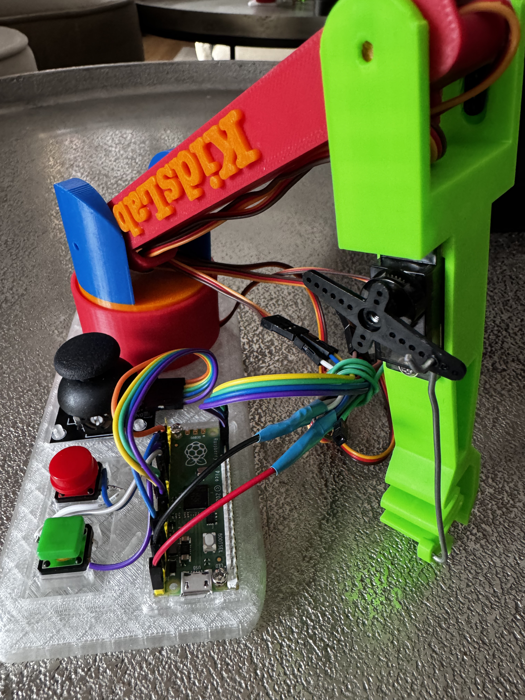

# RoboterArm

Design, Idee und Umsetzung: @dgreiser 

# Was machen wir?
## Step 1: Zusammenbauen
Du baust aus Servomotoren, Gelenken und einem Greifer einen funktionierenden Roboterarm. Keine Sorge, wir erklären alles Schritt für Schritt.

## Step 2: Programmieren
Mit einem Microcontroller (z. B. einem Raspberry Pi Pico) programmierst du, wie der Roboterarm sich bewegen soll. Ob er Sachen greifen, sich drehen oder coole Bewegungen ausführen soll – du steuerst ihn komplett!

# Für wen ist der Workshop?
Für alle zwischen 12 und 18 Jahren, die Lust haben, mit Technik zu experimentieren. Vorkenntnisse? Nicht nötig! Neugier reicht.

# Warum solltest du mitmachen?
- Du lernst, wie Roboter wirklich funktionieren.
- Du tauchst in die Welt der Programmierung ein – ohne langweilige Theorie.
- Du kannst am Ende stolz deinen eigenen Roboterarm präsentieren.
- Es macht einfach mega Spaß, mit anderen zu bauen und zu coden!

# Was brauchst du?
Nichts außer Motivation! Wir stellen alles zur Verfügung, was du für den Workshop brauchst.

# Teileliste - für den Nachbau zuhause

4x  - standard 9g - am besten mit Metalgetriebe
1x  - oder anderen mit CircuitPython-Unterstützung
1x 
1x eine Handvoll Kabel 
2x Knöpfe deiner Wahl - zum Beispiel  
